# 第9章-微服务容器部署与持续集成  

学习目标：

- 理解Dockerfile的作用，能编写简单的Dockerfile脚本完成镜像的构建
- 完成Docker私有仓库的构建，能够运用Maven插件完成镜像的创建与上传
- 理解持续集成，说出持续集成的作用
- 能够完成Gogs 的安装与配置，完成代码的提交
- 能够使用Jenkins完成代码的持续集成


# 1 Dockerfile

## 1.1 什么是Dockerfile

Dockerfile是由一系列命令和参数构成的脚本，这些命令应用于基础镜像并最终创建一个新的镜像。

1、对于开发人员：可以为开发团队提供一个完全一致的开发环境； 
2、对于测试人员：可以直接拿开发时所构建的镜像或者通过Dockerfile文件构建一个新的镜像开始工作了； 
3、对于运维人员：在部署时，可以实现应用的无缝移植。

## 1.2 常用命令


| 命令                                 | 作用                                 |
| ---------------------------------- | ---------------------------------- |
| FROM image_name:tag                | 定义了使用哪个基础镜像启动构建流程                  |
| MAINTAINER user_name               | 声明镜像的创建者                           |
| ENV key value                      | 设置环境变量 (可以写多条)                     |
| RUN command                        | 是Dockerfile的核心部分(可以写多条)            |
| ADD source_dir/file dest_dir/file  | 将宿主机的文件复制到容器内，如果是一个压缩文件，将会在复制后自动解压 |
| COPY source_dir/file dest_dir/file | 和ADD相似，但是如果有压缩文件并不能解压              |
| WORKDIR path_dir                   | 设置工作目录                             |
| EXPOSE port1 prot2                 | 用来指定端口，使容器内的应用可以通过端口和外界交互          |
| CMD argument                       | 在构建容器时使用，会被docker run 后的argument覆盖 |
| ENTRYPOINT argument                | 和CMD相似，但是并不会被docker run指定的参数覆盖     |
| VOLUME                             | 将本地文件夹或者其他容器的文件挂载到容器中              |

## 1.3 使用脚本创建镜像

步骤：

（1）创建目录

```
mkdir –p /usr/local/dockerjdk8
```

（2）下载jdk-8u171-linux-x64.tar.gz并上传到服务器（虚拟机）中的/usr/local/dockerjdk8目录

（3）创建文件Dockerfile  `vi Dockerfile`

```
#依赖镜像名称和ID
FROM centos:7
#指定镜像创建者信息
MAINTAINER ITCAST
#切换工作目录
WORKDIR /usr
RUN mkdir  /usr/local/java
#ADD 是相对路径jar,把java添加到容器中
ADD jdk-8u171-linux-x64.tar.gz /usr/local/java/

#配置java环境变量
ENV JAVA_HOME /usr/local/java/jdk1.8.0_171
ENV JRE_HOME $JAVA_HOME/jre
ENV CLASSPATH $JAVA_HOME/lib/dt.jar:$JAVA_HOME/lib/tools.jar:$JRE_HOME/lib:$CLASSPATH
ENV PATH $JAVA_HOME/bin:$PATH
```


（4）执行命令构建镜像

```
docker build -t='jdk1.8' .
```

注意后边的空格和点，不要省略

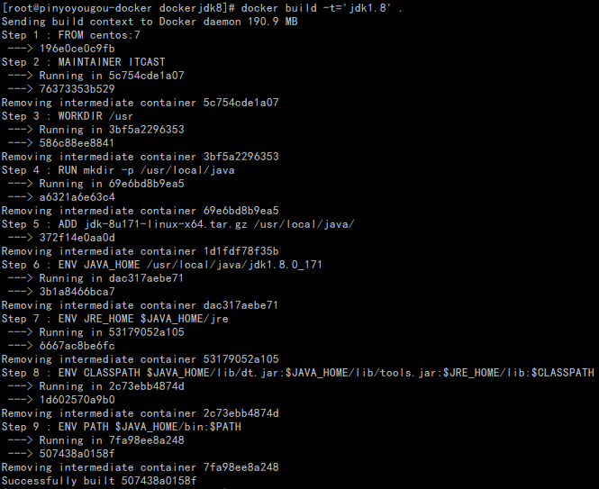

（5）查看镜像是否建立完成

```
docker images
```

（6）创建容器

```
docker run -it --name=myjdk8 jdk1.8 /bin/bash
```

果然可以创建哟~


# 2 Docker私有仓库 

## 2.1 私有仓库搭建与配置

（1）拉取私有仓库镜像（此步省略）

```
docker pull registry
```

（2）启动私有仓库容器

```
docker run -di --name=registry -p 5000:5000 registry
```

（3）打开浏览器 输入地址http://192.168.184.135:5000/v2/_catalog看到`{"repositories":[]}` 表示私有仓库搭建成功并且内容为空

（4）修改daemon.json

```
vi /etc/docker/daemon.json
```

添加以下内容，保存退出。

```json
{"insecure-registries":["192.168.184.135:5000"]} 
```

此步用于让 docker信任私有仓库地址

（5）重启docker 服务

```
systemctl restart docker
```

## 2.2 镜像上传至私有仓库

（1）标记此镜像为私有仓库的镜像

```
docker tag jdk1.8 192.168.184.135:5000/jdk1.8
```

（2）再次启动私服容器

```
docker start registry
```

（3）上传标记的镜像

```
docker push 192.168.184.135:5000/jdk1.8
```

## 2.3 DockerMaven插件

微服务部署有两种方法：

（1）手动部署：首先基于源码打包生成jar包（或war包）,将jar包（或war包）上传至虚拟机并拷贝至JDK容器。

（2）通过Maven插件自动部署。

对于数量众多的微服务，手动部署无疑是非常麻烦的做法，并且容易出错。所以我们这里学习如何自动部署，这也是企业实际开发中经常使用的方法。

Maven插件自动部署步骤：

（1）修改宿主机的docker配置，让其可以远程访问

```
vi /lib/systemd/system/docker.service
```

其中ExecStart=后添加配置`-H tcp://0.0.0.0:2375 -H unix:///var/run/docker.sock`

修改后如下：


（2）刷新配置，重启服务

```
systemctl daemon-reload
systemctl restart docker
docker start registry
```

（3）在tensquare_eureka工程pom.xml 增加配置

```xml
     <build>
        <finalName>app</finalName>
        <plugins>
            <plugin>
                <groupId>org.springframework.boot</groupId>
                <artifactId>spring-boot-maven-plugin</artifactId>
            </plugin>
            <!-- docker的maven插件，官网：https://github.com/spotify/docker-maven-plugin -->
            <plugin>
                <groupId>com.spotify</groupId>
                <artifactId>docker-maven-plugin</artifactId>
                <version>0.4.13</version>
                <configuration>
               <imageName>192.168.184.135:5000/${project.artifactId}:${project.version}</imageName>
                    <baseImage>jdk1.8</baseImage>
                    <entryPoint>["java", "-jar", "/${project.build.finalName}.jar"]</entryPoint>
                    <resources>
                        <resource>
                            <targetPath>/</targetPath>
                            <directory>${project.build.directory}</directory>
                            <include>${project.build.finalName}.jar</include>
                        </resource>
                    </resources>
                    <dockerHost>http://192.168.184.135:2375</dockerHost>
                </configuration>
            </plugin>
        </plugins>
    </build>
```

以上配置会自动生成Dockerfile

```
FROM jdk1.8
ADD app.jar /
ENTRYPOINT ["java","-jar","/app.jar"]
```

（5）在windows的命令提示符下，进入tensquare_eureka工程所在的目录，输入以下命令，进行打包和上传镜像

```
mvn clean package docker:build  -DpushImage
```

执行后，会有如下输出，代码正在上传


浏览器访问  http://192.168.184.135:5000/v2/_catalog  ，输出

```
{"repositories":["tensquare_eureka"]}
```

（6）进入宿主机 , 查看镜像

```
docker images
```

```
REPOSITORY                              TAG                 IMAGE ID            CREATED             SIZE
192.168.184.135:5000/tensquare_eureka   1.0-SNAPSHOT        83efa6b4478c        10 minutes ago      687.9 MB
192.168.184.135:5000/jdk1.8             latest              507438a0158f        6 hours ago         584 MB
jdk1.8                                  latest              507438a0158f        6 hours ago         584 MB
```

输出如上内容，表示tensquare_eureka微服务已经做成镜像

（7） 启动容器：

```
docker run -d --name=eureka -p 6868:6868 192.168.184.135:5000/tensquare_eureka:1.0-SNAPSHOT 
```


# 3 理解持续集成

## 3.1 什么是持续集成

​	持续集成   Continuous integration ，简称CI	

​	随着软件开发复杂度的不断提高，团队开发成员间如何更好地协同工作以确保软件开发的质量已经慢慢成为开发过程中不可回避的问题。尤其是近些年来，敏捷（Agile） 在软件工程领域越来越红火，如何能再不断变化的需求中快速适应和保证软件的质量也显得尤其的重要。

​	持续集成正是针对这一类问题的一种软件开发实践。它倡导团队开发成员必须经常集成他们的工作，甚至每天都可能发生多次集成。而每次的集成都是通过自动化的构建来验证，包括自动编译、发布和测试，从而尽快地发现集成错误，让团队能够更快的开发内聚的软件。

## 3.2 持续集成的特点

- 它是一个自动化的周期性的集成测试过程，从检出代码、编译构建、运行测试、结果记录、测试统计等都是自动完成的，无需人工干预；
- 需要有专门的集成服务器来执行集成构建；
- 需要有代码托管工具支持，我们下一小节将介绍Git以及可视化界面Gogs的使用


## 3.3 持续集成作用

- 保证团队开发人员提交代码的质量，减轻了软件发布时的压力；
- 持续集成中的任何一个环节都是自动完成的，无需太多的人工干预，有利于减少重复过程以节省时间、费用和工作量；


# 4 Gogs

## 4.1 什么是Gogs

Gogs 是一款极易搭建的自助 Git 服务。

Gogs 的目标是打造一个最简单、最快速和最轻松的方式搭建自助 Git 服务。使用 Go 语言开发使得 Gogs 能够通过独立的二进制分发，并且支持 Go 语言支持的 **所有平台**，包括 Linux、Mac OS X、Windows 以及 ARM 平台。

地址：https://gitee.com/Unknown/gogs

## 4.2 Gogs安装与配置

### 4.2.1 安装

（1）下载镜像

```
docker pull gogs/gogs
```

（2）创建容器

```
docker run -d --name=gogs -p 10022:22 -p 3000:3000 -v /var/gogsdata:/data gogs/gogs
```


### 4.2.2 配置

假设我的centos虚拟机IP为192.168.184.135  完成以下步骤

（1）在地址栏输入http://192.168.184.135:3000  会进入首次运行安装程序页面，我们可以选择一种数据库作为gogs数据的存储，最简单的是选择SQLite3。如果对于规模较大的公司，可以选择MySQL  

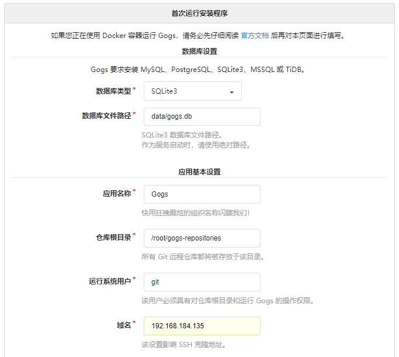

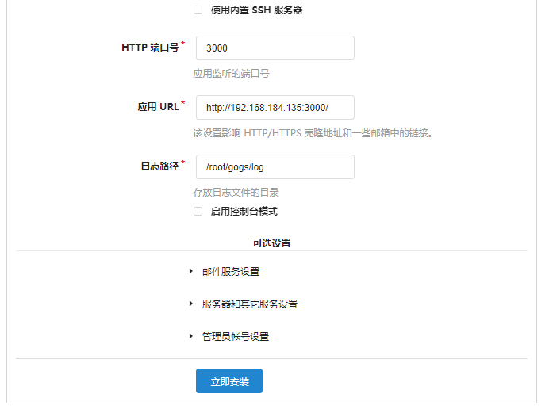 

点击“立即安装”

这里的域名要设置为centos的IP地址,安装后显示主界面


（2）注册

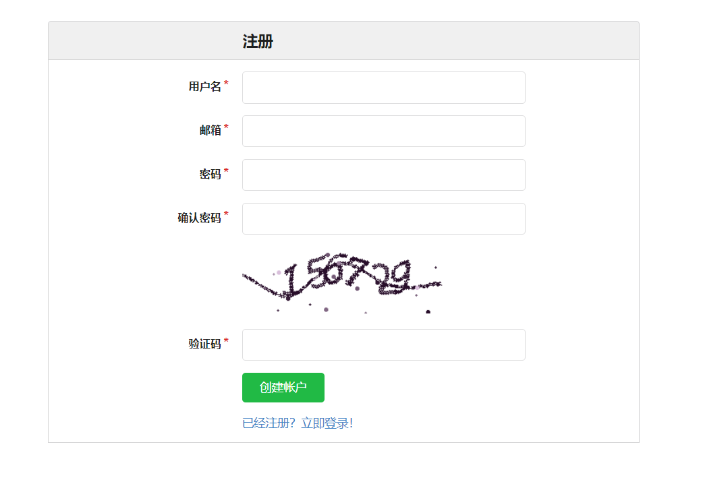

（3）登录

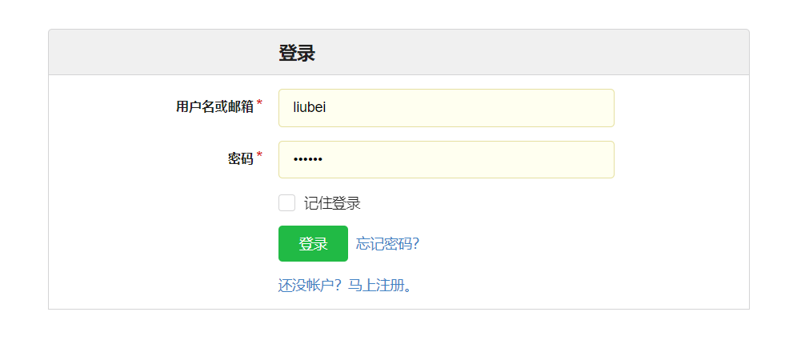

（4）创建仓库 


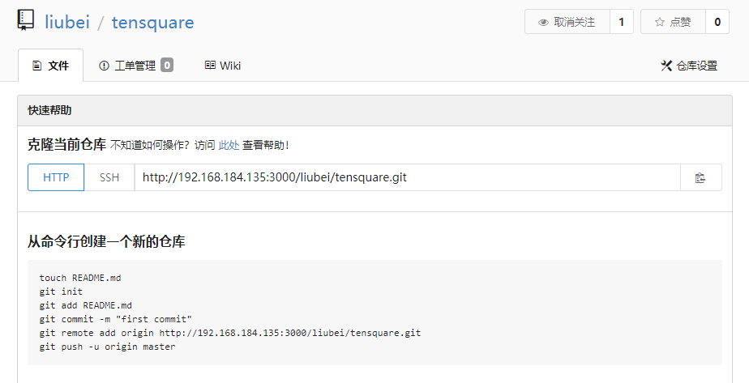

## 4.3 IDEA配置Git

步骤：

（1）在本地安装git(Windows版本)

（2）在IDEA中选择菜单 :  File -- settings ,  在窗口中选择Version Control --  Git

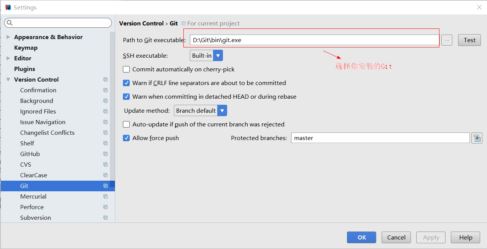


## 4.4 将十次方代码提交到Git

（1）选择菜单VCS  --> Enable Version Control Integration... 


选择Git

（2）设置远程地址:  右键点击工程选择菜单    Git --> Repository   -->Remotes...


（3）右键点击工程选择菜单    Git --> Add

（4）右键点击工程选择菜单    Git --> Commit Directory...

（5）右键点击工程选择菜单    Git --> Repository   --> Push ...


# 5 运用Jenkins实现持续集成

## 5.1 Jenkins简介

​	Jenkins，原名Hudson，2011年改为现在的名字，它 是一个开源的实现持续集成的软件工具。官方网站：[http://jenkins-ci.org/](http://jenkins-ci.org/)。

​	Jenkins 能实施监控集成中存在的错误，提供详细的日志文件和提醒功能，还能用图表的形式形象地展示项目构建的趋势和稳定性。

​	特点：

- 易安装：仅仅一个 java -jar jenkins.war，从官网下载该文件后，直接运行，无需额外的安装，更无需安装数据库；
- 易配置：提供友好的GUI配置界面；
- 变更支持：Jenkins能从代码仓库（Subversion/CVS）中获取并产生代码更新列表并输出到编译输出信息中；
- 支持永久链接：用户是通过web来访问Jenkins的，而这些web页面的链接地址都是永久链接地址，因此，你可以在各种文档中直接使用该链接；
- 集成E-Mail/RSS/IM：当完成一次集成时，可通过这些工具实时告诉你集成结果（据我所知，构建一次集成需要花费一定时间，有了这个功能，你就可以在等待结果过程中，干别的事情）；
- JUnit/TestNG测试报告：也就是用以图表等形式提供详细的测试报表功能；
- 支持分布式构建：Jenkins可以把集成构建等工作分发到多台计算机中完成；
- 文件指纹信息：Jenkins会保存哪次集成构建产生了哪些jars文件，哪一次集成构建使用了哪个版本的jars文件等构建记录；
- 支持第三方插件：使得 Jenkins 变得越来越强大

## 5.2 Jenkins安装

### 5.2.1 JDK安装(此步略)

（1）将jdk-8u171-linux-x64.rpm上传至服务器（虚拟机）

（2）执行安装命令

```
rpm -ivh jdk-8u171-linux-x64.rpm
```

RPM方式安装JDK，其根目录为：/usr/java/jdk1.8.0_171t

### 5.2.2 Jenkins安装与启动 

（1）下载jenkins

```
wget https://pkg.jenkins.io/redhat/jenkins-2.83-1.1.noarch.rpm
```

（2）安装jenkins

```
rpm -ivh jenkins-2.83-1.1.noarch.rpm
```

（3）配置jenkins

```
vi /etc/sysconfig/jenkins
```

修改用户和端口

```
JENKINS_USER="root"
JENKINS_PORT="8888"
```

（4）启动服务

```
systemctl start jenkins
```

（5）访问链接 http://192.168.184.135:8888

从/var/lib/jenkins/secrets/initialAdminPassword中获取初始密码串 


（6）安装插件  

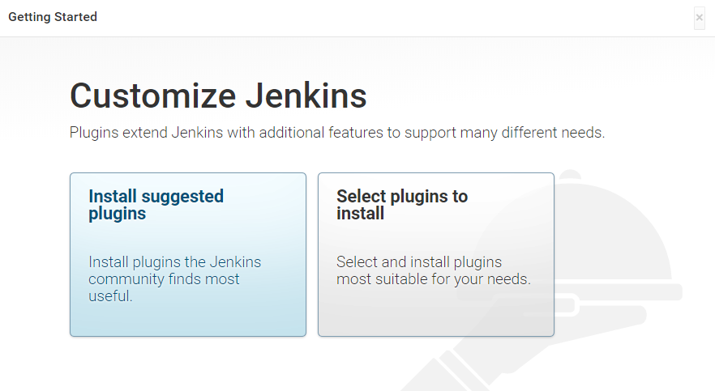

 

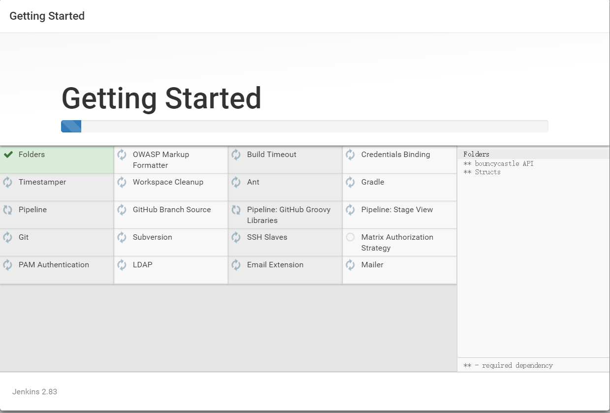

（7）新建用户

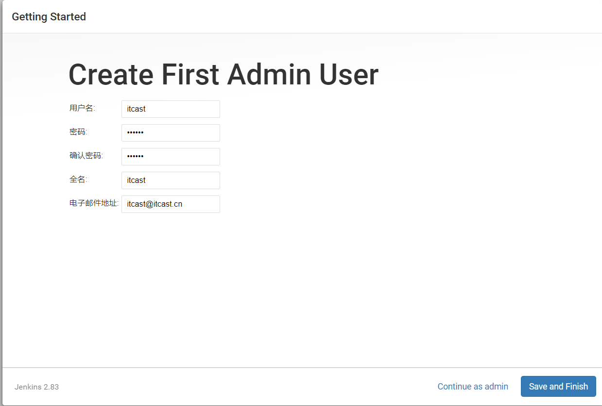

完成安装进入主界面

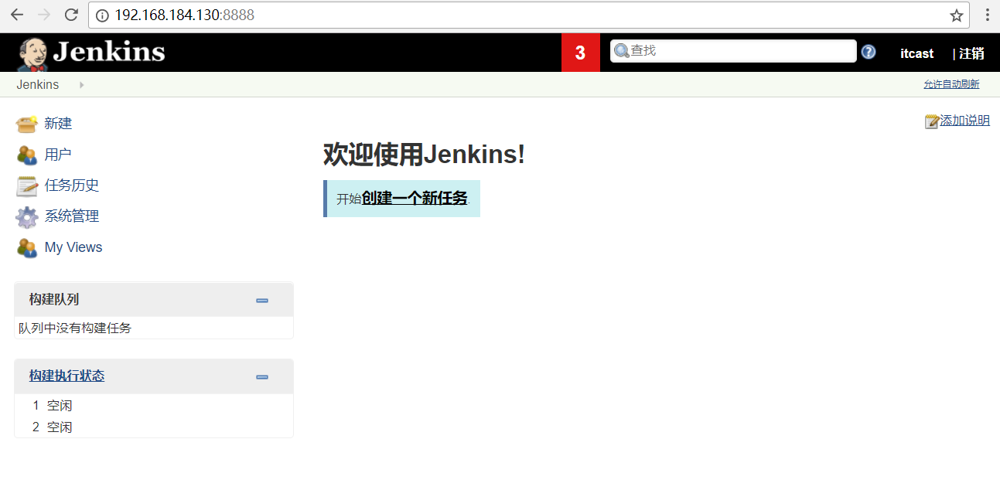

## 5.3 Jenkins插件安装

### 5.3.1 安装Maven插件

（1）点击左侧的“系统管理”菜单 ,然后点击


（2）选择“可选插件”选项卡，搜索maven，在列表中选择Maven Integration  ，点击“直接安装”按钮


看到如下图时，表示已经完成


### 5.3.2 安装Git插件

步骤如上图，搜索git

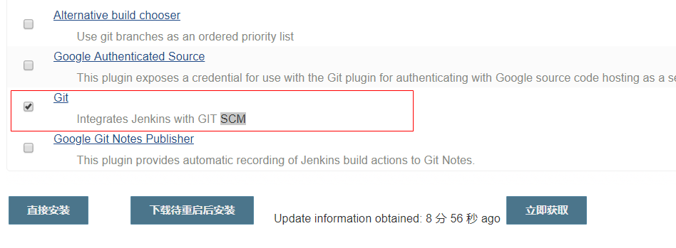

## 5.4 全局工具配置

### 5.4.1 安装Maven与本地仓库

（1）将Maven压缩包上传至服务器（虚拟机）

（2）解压

```
tar zxvf apache-maven-3.3.9-bin.tar.gz
```

（3）移动目录

```
mv apache-maven-3.3.9 /usr/local/maven
```

（4）编辑setting.xml配置文件`vi /usr/local/maven/conf/settings.xml `，配置本地仓库目录,内容如下

```
<localRepository>/usr/local/repository</localRepository>
```

（5）将开发环境的本地仓库上传至服务器（虚拟机）并移动到/usr/local/repository   。

```
mv reponsitory_boot /usr/local/repository
```

执行此步是为了以后在打包的时候不必重新下载，缩短打包的时间。

（6）编辑setting.xml配置文件`vi /usr/local/maven/conf/settings.xml `

```
<pluginGroups>    
    <pluginGroup>com.spotify</pluginGroup>    
</pluginGroups> 
```

### 5.4.2 全局工具配置

选择系统管理，全局工具配置

（1）JDK配置


设置javahome为 /usr/java/jdk1.8.0_171-amd64

（2）Git配置   （本地已经安装了Git软件）


（3）Maven配置


## 5.5 持续集成 

### 5.5.1 创建任务 

（1）回到首页，点击新建按钮 .如下图，输入名称，选择创建一个Maven项目，点击OK


（2）源码管理，选择Git


（3）Build


命令:

```
clean package docker:build -DpushImage
```

用于清除、打包，构建docker镜像

最后点击“保存”按钮

### 5.5.2 执行任务  

返回首页，在列表中找到我们刚才创建的任务


点击右边的绿色箭头按钮，即可执行此任务.

点击下面正在执行的任务

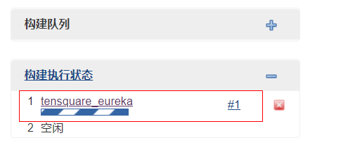

可以看到实时输出的日志

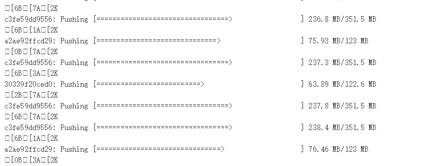

这就是镜像做好了在上传，如果你之前没有将你的本地仓库上传到服务器，会首先下载依赖的jar包，接下来就是漫长的等待了。

看到下面的结果就表示你已经成功了


首战告捷！哈哈，兴奋不？返回首页  看到列表


我们在浏览器看一下docker私有仓库

http://192.168.184.135:5000/v2/_catalog ,会看到tensquare_eureka已经上传成功了

```
{"repositories":["jdk1.8","tensquare_eureka"]}
```

按此方法完成其它微服务的构建

### 5.5.3 完成配置中心的持续集成

（1）配置中心的pom.xml中，添加docker插件

```xml
  <build>
        <finalName>app</finalName>
        <plugins>
            <plugin>
                <groupId>org.springframework.boot</groupId>
                <artifactId>spring-boot-maven-plugin</artifactId>
            </plugin>
            <!-- docker的maven插件，官网：https://github.com/spotify/docker-maven-plugin -->
            <plugin>
                <groupId>com.spotify</groupId>
                <artifactId>docker-maven-plugin</artifactId>
                <version>0.4.13</version>
                <configuration>
                    <imageName>192.168.184.135:5000/${project.artifactId}:${project.version}</imageName>
                    <baseImage>jdk1.8</baseImage>
                    <entryPoint>["java", "-jar", "/${project.build.finalName}.jar"]</entryPoint>
                    <resources>
                        <resource>
                            <targetPath>/</targetPath>
                            <directory>${project.build.directory}</directory>
                            <include>${project.build.finalName}.jar</include>
                        </resource>
                    </resources>
                    <dockerHost>http://192.168.184.135:2375</dockerHost>
                </configuration>
            </plugin>
        </plugins>
    </build>
```

（2）提交代码到git

（3）按照同样的方法，完成配置中心的持续集成。完成后会看到私有仓库中添加了tensquare_config

```
{"repositories":["jdk1.8","tensquare_config","tensquare_eureka"]}
```

（4）创建rabbitMQ容器

```
docker run -di --name=tensquare_rabbitmq -p 5671:5617 -p 5672:5672 -p 4369:4369 -p 15671:15671 -p 15672:15672 -p 25672:25672 rabbitmq:management
```

（5）创建容器：

```
docker run -di --name=config -p 12000:12000 192.168.184.135:5000/tensquare_config:1.0-SNAPSHOT
```

### 5.5.4 完成基础微服务的持续集成

（1）代码中添加docker插件 ,更改配置文件中的配置中心的地址为http://192.168.184.135:12000

（2）提交代码到git

（3）按照同样的方式构建基础微服务

（4）准备数据库环境

```
docker run -di --name=mysql -p 3306:3306 -e MYSQL_ROOT_PASSWORD=123456 centos/mysql-57-centos7
```

（5）创建基础微服务容器

```
docker run -di --name=base -p 9001:9001 192.168.184.135:5000/tensquare_base:1.0-SNAPSHOT
```


### 5.5.5 完成微服务网关的构建

按照同样的步骤完成微服务网关tensquare_web的构建

### 5.5.6 完成其它微服务的构建

学员实现

